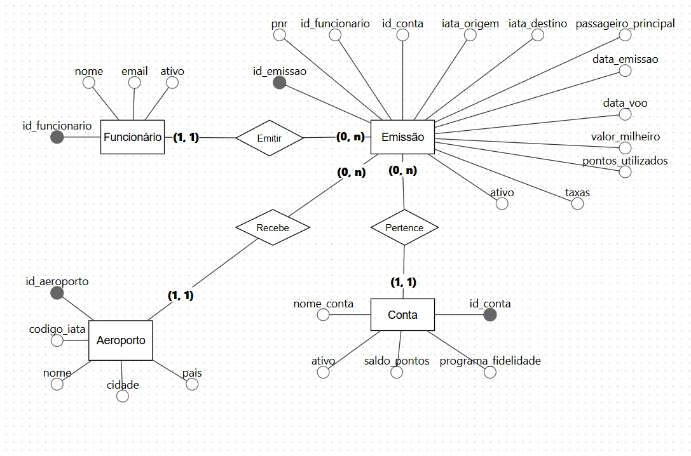
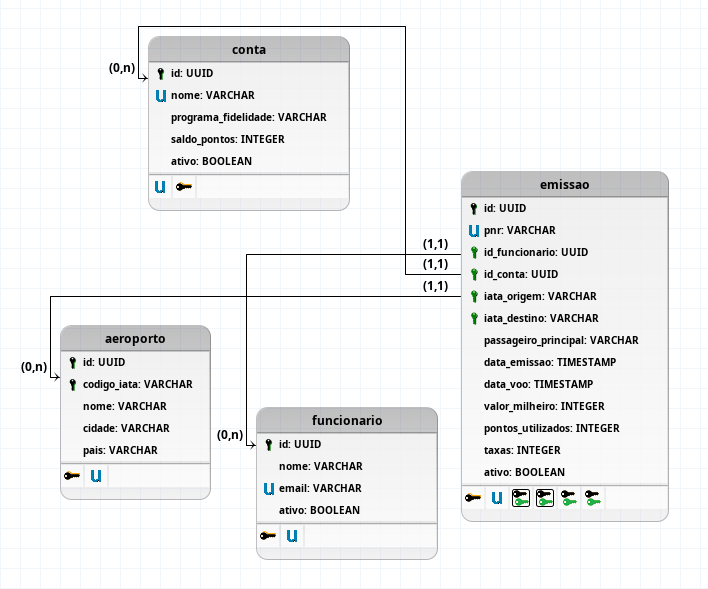

# Trabalho Banco de Dados - Professor Isácio Rafael Pereira

Alunos: Murilo Cândido Germano, João Pedro de Moraes Barros e Guilherme da Costa

Banco de Dados de um *Sistema de Controle de Emissões de Passagens com Pontos de Fidelidade.* 

Feito no Sistema Gerenciador de Banco de Dados: PostgreSQL

### 1. Descrição do Projeto

O sistema tem como objetivo controlar emissões de passagens aéreas utilizando milhas/pontos de fidelidade. O banco de dados armazena informações sobre funcionários, contas de milhas e emissões realizadas, permitindo organização e controle completo das operações relacionadas à emissão, alteração e cancelamento de passagens.

---

### 2. Documento de Requisitos

#### 2.1 Requisitos Funcionais

| **RF01** | Cadastro de funcionários |
| --- | --- |
| **RF02** | Atualizar cadastros de funcionários |
| **RF03** | Deletar Funcionários |
| **RF04** | Cadastro de contas de milhas |
| **RF05** | Registro de emissões |
| **RF06** | Alteração de emissões |
| **RF07** | Cancelamento de emissões |
| **RF08** | Consulta de emissões |
| **RF09** | Relacionamento entre funcionários e emissões |
| **RF10** | Relacionamento entre contas e emissões |
| **RF11** | Cadastro de Aeroportos |
| **RF12** | Relacionamento entre emissoes e aeroportos |

#### 2.2 Regras de Negócio

| **RN01** | PNR deve ser único |
| --- | --- |
| **RN02** | Emissões canceladas não devem ser excluídas |
| **RN03** | Toda emissão deve possuir um funcionário responsável |
| **RN04** | Toda emissão deve utilizar uma conta cadastrada |
| **RN05** | Código IATA deve possuir 3 caracteres |
| **RN06** | Valores monetários devem ser armazenados em inteiros, com precisão de apenas duas casas. |
| **RN07** | Todas tabelas devem utilizar o sistema de UUID ao invés do ID autoincrementado comum. |

---

### 3. Modelo Conceitual (DER)

O modelo conceitual do sistema é composto pelas seguintes entidades principais:

**Entidades:**

- **Funcionário**: representa os colaboradores responsáveis pelas emissões de passagens
- **Conta**: representa as contas de milhas/pontos de fidelidade disponíveis para uso
- **Emissão**: representa cada registro de emissão de passagem realizada
- Aeroporto:  representa os aeroportos pelo mundo, com duas chaves primárias, sendo elas id e PNR.

**Relacionamentos:**

- Um funcionário pode realizar várias emissões (1:N)
- Uma conta pode ser utilizada em várias emissões (1:N)
- Uma emissão pertence a um funcionário (1:1)
- Uma emissão pertence a uma conta (1:1)
- Um aeroporto pode ser origem/destino de várias emissões (1:N)

---

### 4. Modelo Lógico

#### Tabela: Funcionario

**Campos:**

- id_funcionario
- nome
- email
- ativo

**Chave Primária:**

- id_funcionario

**Restrições:**

- email deve ser único
- ativo indica se o funcionário está ativo (true) ou inativo (false)

---

#### Tabela: Conta

**Campos:**

- id_conta
- nome_conta
- programa_fidelidade
- saldo_pontos
- ativo

**Chave Primária:**

- id_conta

**Restrições:**

- nome_conta deve ser único
- saldo_pontos não pode ser negativo
- ativo indica se a conta está ativa (true) ou inativa (false)

---

#### Tabela: Emissão

**Campos:**

- id_emissao
- pnr
- id_funcionario
- id_conta
- iata_origem
- iata_destino
- passageiro_principal
- data_emissao
- data_voo
- valor_milheiro
- pontos_utilizados
- taxas
- ativo

**Chave Primária:**

- id_emissao

**Chaves Estrangeiras:**

- id_funcionario → Funcionarios(id_funcionario)
- id_conta → Contas(id_conta)
- iata_origem → Aeroporto(codigo_iata)
- iata_destino → Aeroporto(codigo_iata)

**Restrições:**

- pnr deve ser único
- codigo_iata_origem e codigo_iata_destino devem ter exatamente 3 caracteres
- ativo indica se a emissão está ativa (true) ou cancelada (false)
- emissões canceladas não devem ser excluídas fisicamente do banco

---

**Tabela: Aeroporto**

**Campos:**

- id_aeroporto
- codigo_iata
- nome
- cidade
- pais

**Chave Primária:**

- id_aeroporto

**Restrições:**

- codigo_iata deve ser único

